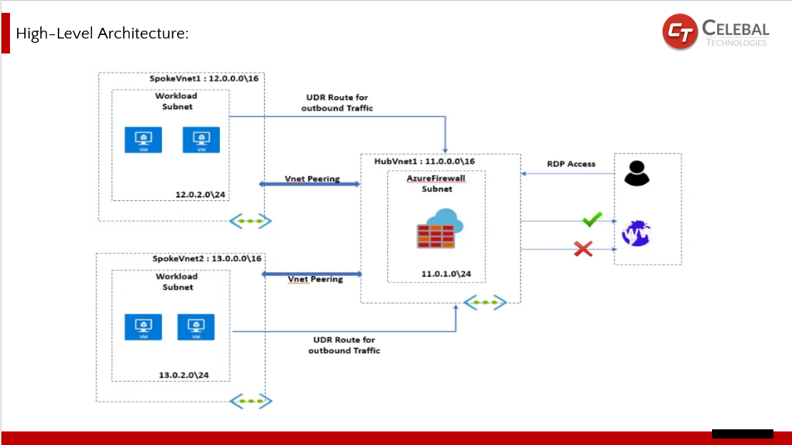

# Azure Hub-and-Spoke Network Architecture using Bicep

This project sets up a secure Hub-and-Spoke network on Azure, where the Hub acts as a central point for managing traffic, and the Spokes are connected VNets that host workloads.

I built this using **Bicep** (an infrastructure-as-code language) to automate the entire deployment.

---

## What’s in This Project

- A **Hub VNet** with an **Azure Firewall** and a public IP
- Two **Spoke VNets** (Spoke1 and Spoke2) that connect to the Hub using VNet Peering
- **Route tables** in the spokes to route internet traffic through the firewall
- A **NAT rule** on the firewall to allow RDP access to a VM in Spoke2
- Infrastructure is fully deployed via **main.bicep**

---

## How It Works

- **Traffic Flow**: Spoke VNets send traffic to the internet through the Hub, where the firewall applies control.
- **Security**: Only approved connections (like RDP) are allowed through the firewall via defined NAT rules.
- **Peering**: Bidirectional peering ensures communication between VNets.
- **Deployment**: Everything is deployed using Azure CLI with Bicep templates.

## 📌 Network Architecture

## 📌 Azure Resource Group

